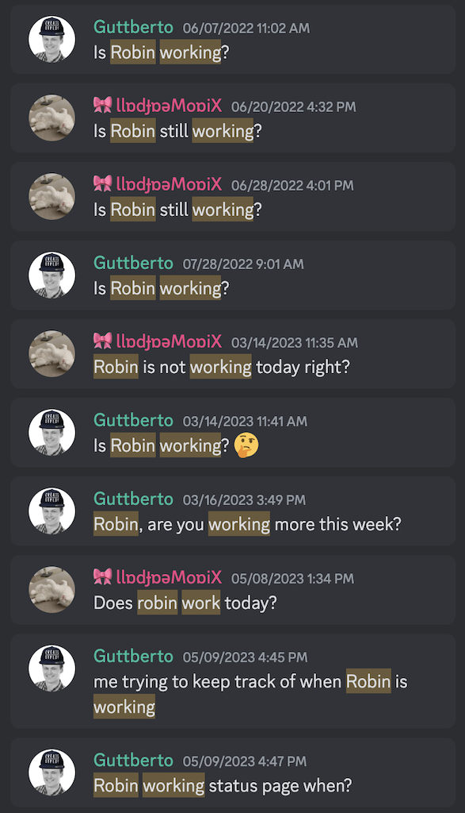

# is-robin-working

A Discord bot for coworkers who works every other day and a team that can't keep track of the days

## Setup

- `yarn` Installs npm dependencies
- `TOKEN=<Discord bot token> yarn dev` Start development environment

## License

[MIT](./LICENSE)
